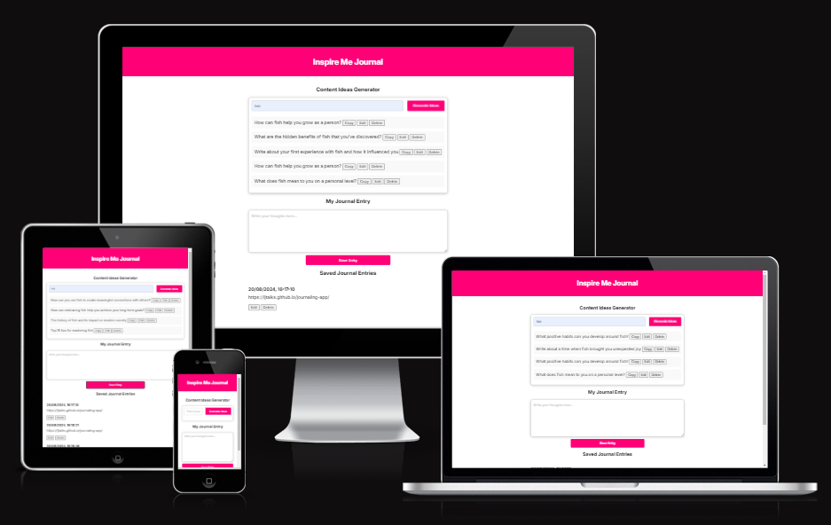

# Inspire Me Journal

# Overview
Welcome to your web-based journaling assistant, designed to help you enhance your productivity, focus, and mental clarity. 

**Journaling** is widely recongnised as a powerful tool to channel thoughts, set goals, and maintain a positive mindset. This app was created to facilitate that process by providing a structured space for daily reflection and idea generation.

This journaling app serves as a practical tool for anyone looking to improve their productivity and mental clarity. It’s a reflection of both my personal experiences and my growing skills in web development. I’m excited to continue improving this project, making it a more powerful resource for daily reflection and inspiration.

👩🏻‍💻 View an example of this section [here](https://github.com/kera-cudmore/Bully-Book-Club#bully-book-club-website)

[Link to live site](https://ljtalks.github.io/journaling-app/)

---

## CONTENTS

* [User Experience](#user-experience-ux)
  * [User Stories](#user-stories)

* [Design](#design)
  * [Colour Scheme](#colour-scheme)
  * [Typography](#typography)
  * [Imagery](#imagery)
  * [Wireframes](#wireframes)

* [Features](#features)
  * [General Features on Each Page](#general-features-on-each-page)
  * [Future Implementations](#future-implementations)
  * [Accessibility](#accessibility)

* [Technologies Used](#technologies-used)
  * [Languages Used](#languages-used)
  * [Frameworks, Libraries & Programs Used](#frameworks-libraries--programs-used)

* [Deployment & Local Development](#deployment--local-development)
  * [Deployment](#deployment)
  * [Local Development](#local-development)
    * [How to Fork](#how-to-fork)
    * [How to Clone](#how-to-clone)

* [Testing](#testing)

* [Credits](#credits)
  * [Code Used](#code-used)
  * [Content](#content)
  * [Media](#media)
  * [Acknowledgments](#acknowledgments)

---

## User Experience (UX)

👩🏻‍💻 View an example of a completed user experience section [here](https://github.com/kera-cudmore/Bully-Book-Club#user-experience-ux)

### User Stories

Add your user stories here. You want to include first time visitors and returning visitors here as a minimum. Think about each group, and the experience and journey you want them to have on your site. It really helps to think about this before you start coding, and will really help with creating your wireframes.

## Design and Colour Scheme

The site design was intentionally kept simple to minimize distractions and focus on content creation. 

I created a simple logo in [Canva](https://www.canva.com/) and converted it to a Favicon using [Favicon.io](https://favicon.io/favicon-converter/)

**Logo and Favicon Design**
The logo and favicon for this journaling app are carefully crafted to embody the essence of the project's purpose: fostering creativity, inspiration, and personal growth. The design features a pink heart (#FF0077), which is both vibrant and warm, symbolizing passion, love, and energy—qualities that are integral to the act of journaling and self-reflection.

At the center of the heart is a white lightbulb icon, representing ideas, creativity, and enlightenment. The lightbulb contains a hand holding a pen, signifying the act of writing, which is at the core of this app. This visual element is designed to evoke the sense of capturing bright ideas and turning thoughts into written words, which is the essence of journaling.

**Symbolism and Emotional Connection**
**Pink Heart (#FF0077)**: The choice of the pink heart as the primary symbol reflects the app’s focus on emotional well-being, self-love, and personal reflection. Pink, being a color associated with warmth, comfort, and positivity, sets the tone for an encouraging and uplifting journaling experience.

**White Lightbulb**: The lightbulb is a universal symbol of ideas and inspiration. By placing it within the heart, the logo suggests that the ideas generated through journaling are deeply personal and rooted in one's emotions and experiences.

**Hand Writing with a Pen**: The hand with the pen inside the lightbulb reinforces the action-oriented nature of the app. It reminds users that journaling is not just about thinking but also about actively capturing and refining those thoughts.

**Design Intent**
The overall design is intended to conjure up feelings of creativity, inspiration, and personal empowerment. The heart shape and bright pink color are welcoming and suggest that the app is a safe, positive space for self-expression. The lightbulb and writing hand encourage users to see their journal as a tool for generating and organizing their thoughts, with the potential to illuminate their path forward.

**By combining these elements, the logo and favicon serve as a visual metaphor for the app's mission: to inspire users to reflect, grow, and thrive through the practice of journaling.**

**Future Colour Options Feature**

Future enhancements include options for users to switch between light and dark modes, catering to different environments and personal preferences. 

Additionally, the option to instantly change the default pink color (#FF0077) to another strong, accessible color such as Azure Blue (#0074D9) or a vibrant Fresh Green (#22C177) will be introduced. 

These color choices are carefully selected to ensure readability and visual comfort, aligning with accessibility standards."

👩🏻‍💻 View an example of a completed design section [here](https://github.com/kera-cudmore/earth-day-hackathon-2022#Design)

I like to include a palette of the colour scheme here, my favourite site for creating a colour palette is [coolors](https://coolors.co/), but there are lots of other sites that also do the same thing, like [ColorSpace](https://mycolor.space/?hex=%23F5F5F5&sub=1), [Muzli Colors](https://colors.muz.li/), [Adobe Colour Wheel](https://color.adobe.com/create/color-wheel) and [Canva](https://www.canva.com/colors/color-palette-generator/) to name a few.

### Typography

I chose the [Google font, Inter](https://fonts.google.com/?query=inter). This choice was driven by a strong desire to enhance accessibility and ensure a smooth user experience for all visitors. 

Inter is a modern, sans-serif typeface that was specifically crafted with readability and clarity in mind.

Inter features several key characteristics that align with accessibility best practices:

**High Readability**: Inter is designed with a large x-height, open apertures, and clear letterforms. These design elements contribute to improved readability, making the text easier to read for users with varying levels of visual acuity.

**Versatility**: The font includes a wide range of weights and styles, providing flexibility in design while maintaining visual consistency. This versatility allows for effective typographic hierarchies and clear differentiation between various text elements, enhancing overall user comprehension.

**Optimized for Digital Screens**: Inter was created with digital screens in mind, incorporating features that reduce eye strain and improve legibility on various devices. This focus on screen readability ensures that users can comfortably interact with the content across different platforms and screen sizes.

**Accessible Design**: The font's design takes into account accessibility concerns, such as avoiding confusing characters and ensuring sufficient contrast between different weights and styles. This attention to detail helps create an inclusive experience for all users, including those with visual impairments.

By incorporating Inter into the app's design, I aimed to provide a clear, user-friendly reading experience that supports productivity and enhances the overall usability of the journaling tool. The choice reflects a commitment to accessibility and a dedication to creating a positive, engaging environment for users to reflect, plan, and inspire themselves.

### Imagery

**Current Imagery**
The current design of the journaling app embraces simplicity and clarity, with a deliberate choice to limit the use of images. This minimalist approach helps to keep the focus on the core functionalities of the app—generating content ideas and journaling—without unnecessary distractions

**Future Plans: Vision Board Feature**

**Looking ahead**, one of the exciting planned enhancements for the app is the introduction of a Vision Board feature. This addition will expand the app’s functionality by allowing users to:

**Add Personal Images**: Users will be able to upload and integrate their own images into a vision board. This feature will enable them to visually represent their goals, inspirations, and dreams, making the journaling experience more personal, focused and engaging.

**Set Goals**: The Vision Board will include functionality for setting and tracking personal goals. Users can add specific goals, deadlines, and milestones, providing a structured way to define and pursue their aspirations.

**Break Down Goals**: To support goal achievement, the Vision Board will allow users to break down their larger goals into smaller, manageable tasks. This feature will help users create actionable steps, making it easier to track progress and stay motivated.

By incorporating a Vision Board, the app will offer a more comprehensive tool for personal development. This feature aims to enhance user engagement by combining visual inspiration with actionable goal-setting, ultimately supporting a more dynamic and effective journaling experience.

### Wireframes

**Wireframes and Initial Design**:
The initial design of the journaling app was guided by a commitment to simplicity and clarity. To visualize this design, I created simple wireframes using Miro. These wireframes reflect the clean and straightforward lines intended for the app's interface. 

My original plan included integrating an inspirational quote from an API in the first box to set a positive tone for the user. However, I encountered difficulties with API integration, so this feature will be added in a future update.

Whilst testing the apps functionality, I realised the application had a major flaw, so in order to address this, and improve the overall experience, the Saved Journal Entries section was added. 

## Features

**Content Ideas Generator**: To spark creativity, the app includes a Content Ideas Generator. Users can input a keyword or topic, and the app generates a variety of thought-provoking prompts. This feature is particularly useful for overcoming writer’s block or for guiding the journaling process.

Multiple ideas can be generated, copied, edited, then copied or delelted. The edit function works, but for future I would like to make this process more in line with the style of the app, perhaps using a JavaScript modal, however it is functional, and allows the idea to be edited, then copied or deleted. 

The Copy idea function copies the generated idea to the users clipboard, then moves the cursor directly into the Journalling box so the user can simply paste their idea directly and get started with their journaling.  

**Journal Entry Section**: The core of the app is the journal entry section, where users can write and save their thoughts. Each entry is saved with a timestamp, making it easy to track progress over time. The journal entries are stored in the browser's local storage, ensuring that they remain accessible and editable even after closing the app.

**Entry Management**: Users can view, edit, and delete their saved journal entries directly from the main page. This functionality is designed to make the journaling process seamless and flexible.

👩🏻‍💻 View an example of a completed user experience section [here](https://github.com/kera-cudmore/TheQuizArms#Features)

### General features on each page

If there is a feature that appears on all pages of your site, include it here. Examples of what to include would the the navigation, a footer and a favicon.

I then like to add a screenshot of each page of the site here, i use [amiresponsive](https://ui.dev/amiresponsive) which allows me to grab an image of the site as it would be displayed on mobile, tablet and desktop, this helps to show the responsiveness of the site.

### Future Implementations

**Inspirational Quote** (Future Implementation): The first feature intended for the app was an uplifting or inspiring quote that would greet the user each day. This quote would set a positive tone, fostering gratitude and focus before diving into the journal entry. While I encountered challenges with integrating the API for this feature, it's a planned addition for future updates.

**The main problem with journaling apps: you have to remember to open them.** 
We're about to introduce a pop up (Modal) to remind you, and assist you to set up "inspire Me Journal" as your home page on your preferred browser. Every time you open a new web browser window, you'll have a visual reminder to think about your next journal entry. 

The upcoming paid subsription version (£3/month) will email you once a day, at the time of your choice, reminding you that it's time to start your journal. You could even complete your journal by simply replying to that email.

**API Integration for Inspirational Quotes**: Successfully implement the API to fetch daily inspirational quotes.

**Enhanced Entry Management**: Add sorting, filtering, and search capabilities for journal entries.

**Direct post to your Social Media Networks**
Sign into your social newtworks inside the app and directly post your journal entry to your preferred networks. 

**Add your photos or images to your journal post**
Ever heard the saying "Show, don't tell"? A picture can speak a thousand words. Add your photo's/images to your journal entries to enhance your experience. 

### Accessibility

Be an amazing developer and get used to thinking about accessibility in all of your projects!

This is the place to make a note of anything you have done with accessibility in mind. Some examples include:

Have you used icons and added aria-labels to enable screen readers to understand these?
Have you ensured your site meets the minimum contrast requirements?
Have you chosen fonts that are dyslexia/accessible friendly?

Code Institute have an amazing channel for all things accessibility (a11y-accessibility) I would highly recommend joining this channel as it contains a wealth of information about accessibility and what we can do as developers to be more inclusive.

## Technologies Used

👩🏻‍💻 View an example of a completed Technologies Used section [here](https://github.com/kera-cudmore/Bully-Book-Club#Technologies-Used)

### Languages Used

HTML CSS & JavaScript

### Frameworks, Libraries & Programs Used

Gitpod
Github
Miro
W3 HTML and CSS Validators
JSHint JavaScript Validator

(Add any frameworks, libraries or programs used while creating your project.

Make sure to include things like git, GitHub, the program used to make your wireframes, any programs used to compress your images, did you use a CSS framework like Bootstrap? If so add it here (add the version used).

A great tip for this section is to include them as you use them, that way you won't forget what you ended up using when you get to the end of your project.)

## Deployment & Local Development

### Deployment

The site is deployed using GitHub Pages - [Inspire Me Journal](https://ljtalks.github.io/journaling-app/).

To Deploy the site using GitHub Pages:

Login (or signup) to Github.
Go to the repository for this project, ljtalks/journaling-app/.
Click the settings button.
Select pages in the left hand navigation menu.
From the source dropdown select main branch and press save.
The site has now been deployed, please note that this process may take a few minutes before the site goes live.

### Local Development

The local development section gives instructions on how someone else could make a copy of your project to play with on their local machine. This section will get more complex in the later projects, and can be a great reference to yourself if you forget how to do this.

#### How to Fork

To fork the repository:

Log in (or sign up) to Github.
Go to the repository for this project, ljtalks/journaling-app
Click the Fork button in the top right corner.

#### How to Clone

To clone the repository:

Log in (or sign up) to GitHub.
Go to the repository for this project, ljtalks/journaling-app
Click on the code button, select whether you would like to clone with HTTPS, SSH or GitHub CLI and copy the link shown.
Open the terminal in your code editor and change the current working directory to the location you want to use for the cloned directory.
Type 'git clone' into the terminal and then paste the link you copied in step 3. Press enter.

## Testing

### Discovery and Enhanced Functionality:
During testing, I realized that while the app was designed to save journal entries upon clicking the "Save Journal" button, there was no straightforward way to access and review these entries. This limitation led me to explore ways to display and manage the saved entries within the app.

To address this, I investigated and implemented functionality that allows users to view, edit, and delete their saved journal entries. This enhancement was simpler to integrate than anticipated and significantly improved the app's usability. The approach for managing journal entries drew inspiration from the ideas and functionality I had learned while developing a to-do app, which proved to be highly effective.

The addition of these features not only resolved that issue but also enriched the app's functionality, making it a more robust and user-friendly tool for journaling. This enhancement has greatly improved the overall experience, and I am pleased with the outcome of this **iterative design process**.

### JS Hint

**JS Initial tests**

This identified an error in my initial JS Script, where I had neglected to add an "Event Listener" to my "Delete journal entry" button. 

**JS Final Tests**

**JavaScript Code Quality and Validation**
To ensure the JavaScript code adheres to best practices, I used [JS Hint](https://jshint.com/) for validation. This tool provides valuable insights into the structure and complexity of my code:

- Functions: 16 in total, with most functions being straightforward, handling minimal logic.
- Complexity: The most complex function has a cyclomatic complexity of 3, while the median is 1, indicating low branching and simplicity.
- Size: The largest function has 10 statements, with a median size of 3.5 statements.
- These metrics suggest that the code is modular and easy to maintain, with some opportunities for optimization, particularly in reducing redundancy and simplifying logic.

### W3 Validator - HTML
**HTML Initial Tests**

**HTML Final Tests**

### W3 CSS Validator

**CSS Initial Tests**

**CSS Final Tests**

### Am I Responsive

The site was designed with a Mobile First approach to ensure optimal usability on smaller screens. Additional upscaling was implemented for larger screens to enhance the visual experience. The site adjusts its layout effectively based on the screen size, providing a user-friendly interface across different devices.

The image above demonstrates how the site loads on first use, prior to generating any ideas or saving any entries. While the initial load appears as shown, the app is expected to display correctly once data is stored locally. This issue does not significantly impact the overall user experience, but I am actively working to address and rectify this bug to ensure consistent functionality and appearance.

view the example TESTING.md file [here](milestone1-testing.md)

### Real World Mobile Device Testing; Galaxy S20+ (Android) Mobile

To ensure that the site performs well across different devices, I accessed the deployed site on a Samsung Galaxy S20+ running Android. The app displayed correctly and functioned smoothly, maintaining the design integrity and responsiveness across various screen sizes.

I specifically tested the **Journaling Ideas Generator** and **Save Entry** features, ensuring that all buttons and interactive elements worked as intended. The user interface was easy to navigate, and the performance was consistent with that of the desktop version. The screenshots above demonstrate how the site appeared during this testing.

While I did not use a tool equivalent to Lighthouse on mobile, the visual and functional checks confirmed that the app meets my expectations for mobile usability.

### Lighthouse

Lighthouse scores were initially disapointing, although I later realised I was testing the same browser that I had been using the application, which affected the scores. However, in doing this, I came to learn a lot about accessibility, particularly how dynamically created content can affect accessibility scores. 

Further recommendations were made regarding images. The only image in the app is the logo, which was a .png file. By converting this to .webp format, the score was improved 

Also, to help with Cumulative Layout Shift, the height and width of any images should be specified within the image tag in the html, as this helps the browser to calculate the aspect ratio and allocate the appropriate space even before the image is fully loaded. 

## Learning Outcomes

This project, while simple in scope, allowed me to deepen my understanding of JavaScript, CSS, and HTML. 

I focused on creating a responsive and user-friendly interface, while also incorporating important features like local storage and dynamic content generation. 

The challenges I faced, particularly with the API integration for the quote feature, have given me insight into areas for further learning and development.

**Future Code Improvements**
To ensure the app remains scalable and maintainable, several potential improvements could be made to the JavaScript code:

**Consolidate Functions**: Some functions, like those handling edit and delete actions for ideas and journal entries, could be refactored into more generic, reusable functions. This would reduce redundancy and make the code more DRY (Don't Repeat Yourself).

**Modularize Code**: Breaking down larger functions into smaller, more focused functions would improve readability and make it easier to manage the code as the project grows.

**Enhance Reusability**: By creating reusable components and utilities, the app can be more easily extended with new features, ensuring that future enhancements don’t lead to overly complex or unwieldy code.

These changes will help maintain a clean, efficient codebase, making it easier to implement future features without compromising the app's performance or scalability.

## Credits

👩🏻‍💻 View an example of a completed Credits section [here](https://github.com/kera-cudmore/BookWorm#Credits)

[github.com/adam-p Markdown Cheatsheet](https://github.com/adam-p/markdown-here/wiki/Markdown-Cheatsheet)

[Kera Cudmore Readme Examples](https://github.com/kera-cudmore/readme-examples/blob/main/milestone1-readme.md)

Example Deployment & Local Development section [here](https://github.com/kera-cudmore/TheQuizArms#Deployment)

[Here is my learning repository where I have attempted various YouTube tutorials whilst learning JavaScript, each project is credited with the source](https://ljtalks.github.io/my-first-js/)

### Code Used

I had a lot of assistance from recent YouTube tutorials I have tried. Many of these projects can be found [here](https://ljtalks.github.io/my-first-js/) 

As well as my previous projects, I frequently referred to Google, W3Schools,  and Chat GPT to ensure my code was as clean, logical and well structured as I could make it. 

### Content and Ideas

This site was developed as my first personal project during the Code Institute's 16-week Intensive Full Stack Developer Course. I chose to create an app for journaling and productivity, a tool I intend to use personally and continually enhance over time.

The primary focus of this project is to deliver a functional and intuitive journaling and idea generation tool. The content is intentionally minimal, designed to enhance the overall user experience without distractions.

**Content Creation**
All text, including placeholders, prompts, and instructions, was crafted to be clear, concise, and aligned with the app’s functionality. This includes the introductory text, button labels, and user prompts.

###  Media

While the current version of the site does not utilize any external media (images, audio, video, etc.), this section is reserved for future updates. Should the site evolve to include features like the vision board, any media used will be appropriately credited here, with links back to the source and details on where it is used within the site.

###  Acknowledgments

I would like to extend my gratitude to Elaine and Mark, the facilitators of the Code Institute Full Stack Developer Course, for their invaluable advice, materials, and infectious positive attitudes. Their guidance has been instrumental throughout this journey. I also want to acknowledge my fellow students, whose camaraderie, support, and encouragement have made this learning experience truly enjoyable and enriching.

Lastly, a special thank you to my virtual office assistant, ChatGPT, for mostly always being there with helpful advice, coding tips, and the occasional dose of humor, making remote work a little less lonely!
